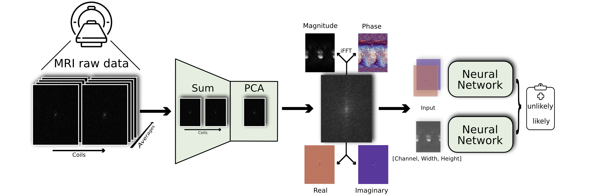

# Tumor-likelihood-estimation-on-MRI-prostate-data-by-utilizing-k-Space-information

[](https://www.python.org/downloads/release/python-3106/) </a> [](https://opensource.org/licenses/Apache-2.0) [](https://black.readthedocs.io/en/stable/getting_started.html)

<div align="center">

[Project content & structure](#Project-content-structure) • [Getting started](#getting-started) • [Usage](#usage) • [Citation](#Citation)

</div>

This repository contains the implementation for the paper "Tumor-likelihood-estimation-on-MRI-prostate-data-by-utilizing-k-Space-information", a framework to predict the prostate cancer likelihood by utilizing MRI raw data. This pipeline surpasses the traditional approach of only using magnitudinal data.

This work is part of the **k-Radiomics** project. For more information, please visit our project-website https://k-radiomics.ikim.nrw.

## Project content & structure



This repository provides the full pipeline, from data preparation, including principal component analysis, to training and testing of the network.


**Project folder structure**:
```bash  
├── logs                  # Location of logs created during training / testing
├── output                # Location of output created during training
└── src  
    ├── configs           # Config files for training
    ├── datasets          # Dataset class and csv-files
    ├── preprocessing     # Preprocessing functions for preparing the raw data
    └── utils             # Utility functions
```

## Getting started
1. Clone repository:
   
       git clone https://github.com/TIO-IKIM/tumor-likelihood-estimation-on-MRI-prostate-data-by-utilizing-k-Space-information.git
   
2. Create a conda environment with Python version 3.11.2 and install the necessary dependencies:
   
       conda create --name kpred python=3.11.2

3. Go into the git repository and install the necessary dependencies

       pip install -r requirements.txt

3. Activate your new environment:

       conda activate kpred

## Usage

The repository includes an exemple for preparing the [FastMRI Prostate raw dataset](https://fastmri.med.nyu.edu) for training the network by applying either GRAPPA or a simple PCA on the k-Space data and splitting it into 2D slices. You can find the script at ```src/preprocessing/dwi_reconstruction.py```.
To use the dataset you have to apply for usage. Afterwards you will receive download-links. Adapt the paths in the reconstruction script according to your data location.

**Training CLI** of ```src/train_dwi.py```

```
usage: Training [-h] [--e E] [--log LOG] [--gpu GPU] [--config CONFIG]

Train a neural network to predict the likelihood of PCa on the FastMRI Prostate raw dataset.

options:
  -h, --help            show this help message and exit
  --e E                 Number of epochs for training. Defaults to 100.
  --log LOG             Define debug level. Defaults to INFO.
  --gpu GPU             GPU used for training.
  --config CONFIG       Path to configuration file
```
Checkpoints of the model are saved whenever the validation metric improves.

To test the model, run the testing script at ```src/test_classifier.py```.

## Citation
```latex
@article{@article{rempe2024tumor,
  title={Tumor likelihood estimation on MRI prostate data by utilizing k-Space information},
  author={Rempe, Moritz and H{\"o}rst, Fabian and Seibold, Constantin and Hadaschik, Boris and Schlimbach, Marco and Egger, Jan and Kr{\"o}ninger, Kevin and Breuer, Felix and Blaimer, Martin and Kleesiek, Jens},
  journal={arXiv preprint arXiv:2407.06165},
  year={2024}
}
```

